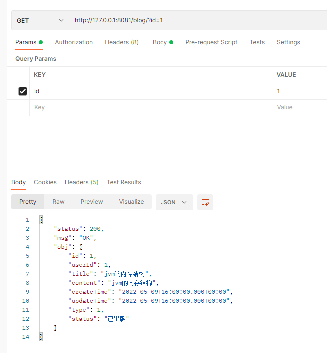
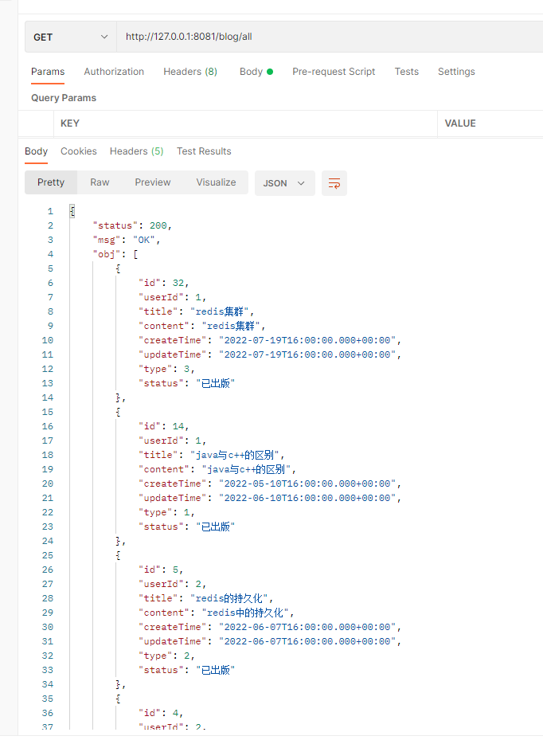
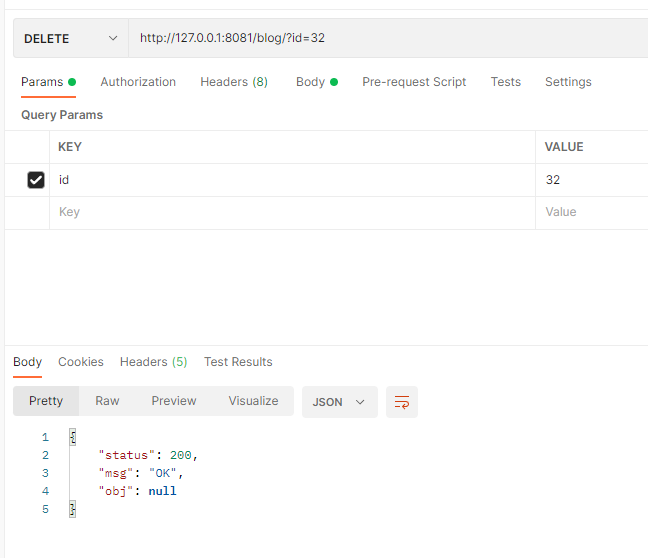
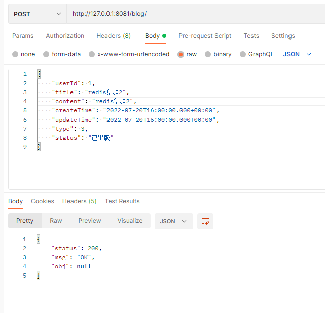
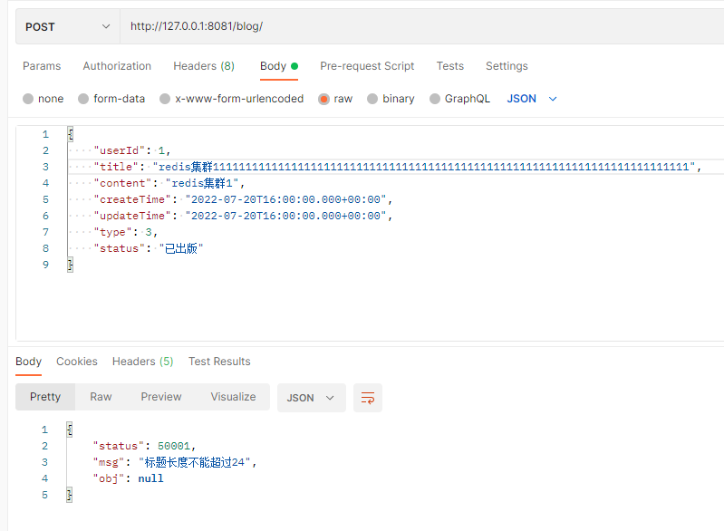
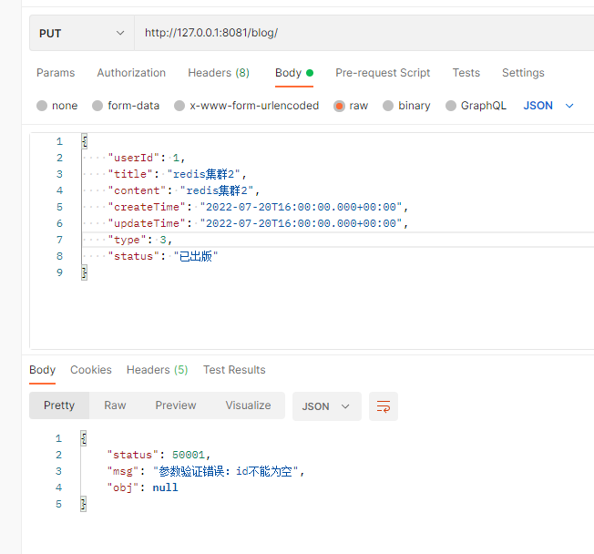
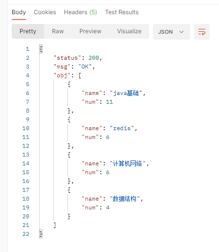
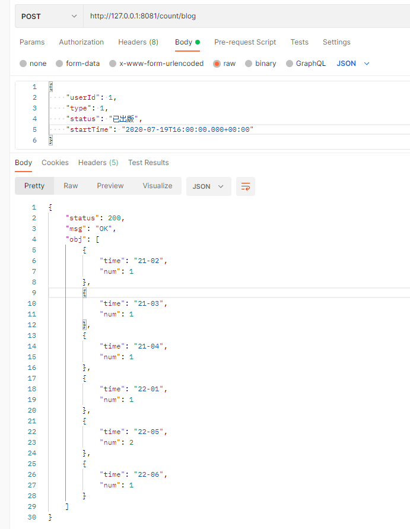

### 完成情况
1. 针对blog进行增删改查
2. 导入功能：单条记录导入；多条记录导入（excel文件）
3. 对于多维度统计：1、根据多维度的查询条件，按月统计出blog的数量；2、统计blog的type的分布情况
4. 以 blog中的status属性为枚举类

### postman结果
1. 根据id查询blog成功   

2. 查询所有的blog成功     

3. 根据id删除blog成功  

4. 插入blog成功   

5. 插入blog失败（标题长度不能超过24）

6. 更新blog失败（blog的id不能为空）   

7. 统计blog的type的分布情况   

8. 关于blog的多维度查询     
